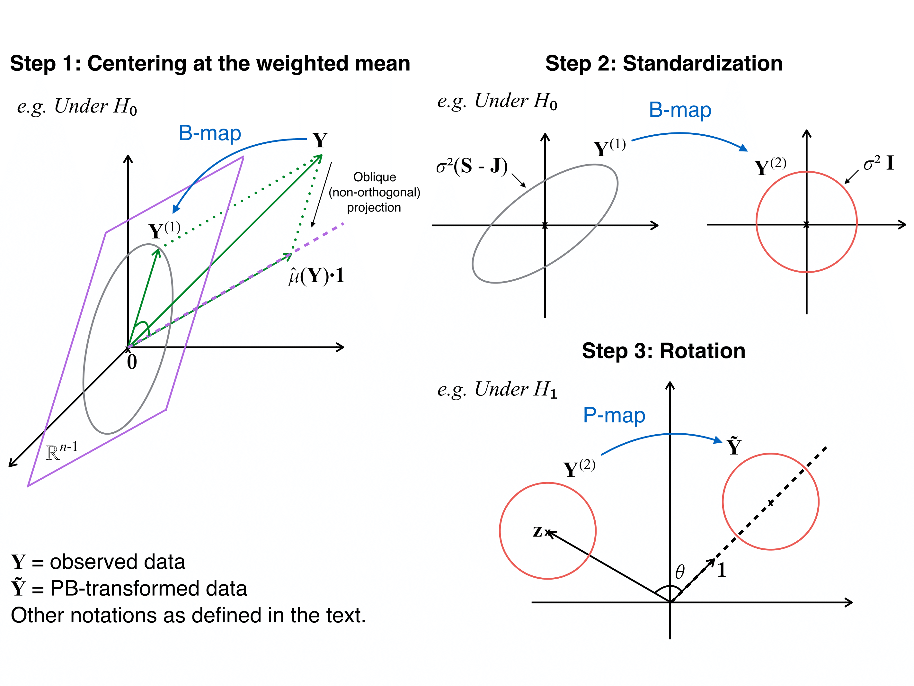

################################################################    
           
# Installation

The package can be installed using the following code.
```{r, installation, eval=FALSE}
library(devtools)
install_github("yunzhang813/PBtest-R-Package", build_vignettes=TRUE)
```
                      
# Introduction

```{r, package, message=FALSE, cache=TRUE}
## Library the package
library(PBtest)
```

This R package is built for the PB-transformed parametric and semi-parametric test, which are computationally efficient hypothesis testing methods for correlated observations and heterogeneous variance structure. A graphical illustration of the transformations is provided below. For more technical details, please refer to @zhang2018highly. 

{ width=80% }


In this documentation, we present a working example for two-group comparison, where the data are contaminated with correlated observations and heterogeneous data qualities. Using the working example, we compare several aspects of the PB-transformed t-test and an alternative approach using liner mixed-effects model (LMER), including adjusted degrees of freedom (DF), correlation estimation, and **computational time**. **The PB-transformed test is 300 times faster than the LMER approach.**


################################################################

# Functions

In this package, we provide the one-step testing function `PBtest()` and other useful functions for key elements of the testing procedure. For detailed information of the arguments in the functions, please also refer to the corresponding help pages, e.g. using `?PBtest`.

## One-step testing function: `PBtest()`

* `PBtest(YY, xx, Sigma=NULL, test="t", id=NULL, weights=NULL, debug=FALSE)` conducts the PB-transformed t-test (with `test="t"`) or the PB-transformed Wilcoxon test (with `test="wilcox"`), and directly outputs a list of p-value(s) (`$p.value`), test statistic(s) (`$statistic`), and adjusted degrees of freedom (`$df`) by `KRapprox()` (see below). The input data are `YY` and `xx`. Depending on different levels of *a priori* information, the following options are available.
    + If `Sigma` is known, set `Sigma=Sigma` and leave `id=NULL, weights=NULL`.
    + If `Sigma` is unknown, the one-step function estimates `Sigma` using `getSigma()` (see below). In the arguments here, set `Sigma=NULL, id=id, weights=weights` or `NULL`. If `weights=NULL`, equal weights of 1 will be assigned.
    + If `Sigma=NULL, id=NULL, weights=NULL`, the identity matrix will be used for `Sigma`.


## Useful functions

* The `debug=TRUE` option and `PBmap()`. These will provide more insights of the testing procedure. They output a long list of intermediate products, e.g. PB-transformed data (`$YY.tilde`), B-map (`$BB`), and P-map (`$PP`).

* Correlation estimation for repeated measurements: `getSigma()` and `getRho()`. These functions implement the moment estimator of correlation proposed in @zhang2018highly, which are used to estimate the `Sigma` in the one-step function if unknown.

* Kenward-Roger approximation to the degrees of freedom: `KRapprox()`. This function calculates the adjusted degrees of freedom using Kenward-Roger approximation. It is modified from the `pbkrtest` package. Please also refer to @halekoh2014kenward.

################################################################

# Data

We downloaded a set of RNA-seq gene expression data from [The Cancer Genome Atlas (TCGA)](https://cancergenome.nih.gov/). The data are sequenced on the Illumina GA platform with tissues collected from breast cancer subjects.  In particular, we selected 28 samples from the tissue source site "BH", which are controlled for white female subjects with the HER2-positive biomarkers. After data preprocessing based on nonspecific filtering, a total number of 11,453 genes are kept for subsequent analyses.  Among these data are 12 pairs of matched tumor and normal samples, and 4 unmatched tumor samples. The sequencing depths of the selected samples range from 23.80 million reads to 76.08 million reads. In the proposed analysis, we inversely weigh the sequencing samples by their sequencing depths (per million reads).

The package provides the above sample data in `HER2`, which is preprocessed sequencing data and can be loaded using `data()`. The data is stored in a list with elements `dat, Grp, seq.depth, Subj`. Note, `dat` is the gene expression matrix with *samples in rows and genes in columns*, which is the transpose of commonly obtained gene expression matrix.

```{r, data, results='hide', cache=TRUE}
## load example data from the package
data(HER2)

## look for help file of the loaded object
?HER2 #this is a list

## attach elements from a list to the global environment
list2env(HER2, globalenv())
```

# Analyses

We are interested in the group comparison between the tumor group and the normal group. For properly preprocessed sequencing data, a proximity of normality can be warranted. A naive t-test is not appropriate for this data set, since the samples are not independent and identically distributed. Therefore, we consider the following analyses.

## PB-transformed t-test

The following chunk provides example codes for conducting the PB-transformed t-test.

```{r, PBtest, cache=TRUE}
tt.PB <- system.time(
  out.PB <- PBtest(YY=dat, xx=Grp, test="t", id=Subj, weights=seq.depth)
)

## p-values
pvec.PB <- out.PB$p.value

## degrees of freedom
df.PB <- out.PB$df

## estimated correlation
rho.hat.PB <- getRho(YY=dat, xx=Grp, id=Subj, weights=seq.depth) #average across all genes
```

It takes `r tt.PB[1]` seconds (YMMV) to conduct the PB-transformed t-test for 11,453 genes. P-values can be accessed in `pvec.PB`. The average correlation across all genes is `r round(rho.hat.PB,3)`. The adjusted DF is `r round(df.PB,3)`.

## Alternative approach using mixed-effects model

The linear mixed-effects model (LMER) is an alternative approach to fit the data and conduct the group comparison. The correlated samples can be handled using a random intercept term for subjects, and weights can also be incorporated in this approach.

For each gene, suppose the $i$th sample is from the $l$th subject, we fit a random intercept model such that
\[
Y_{i(l)} = \mu + x_{i} \beta + 1_{l} \gamma + \epsilon_{i},
\]
where $1_{l}$ is an indicator function for the $l$th subject, $\gamma \sim N(0, \sigma^2_{\gamma})$, and $\epsilon_{i} \sim N(0, \sigma^2_{\epsilon})$. In this model, the correlation can be computed as
\[
\rho = \mathrm{cor}(Y_{i(l)}, Y_{i'(l)}) = \frac{\sigma^2_{\gamma}}{\sigma^2_{\gamma} + \sigma^2_{\epsilon}}.
\]

The following chunk prepares the implementation of the above model using the `lmerTest` package.

```{r, LMER-prepare, message=FALSE, cache=TRUE}
## package for LMER and related tests
library(lmerTest)

## function for fitting the weighted LMER
my.lmer.weighted <- function(dat, group, id, weights){
  mod <- lmer(dat ~ group + (1|id), weights = weights)
  out <- summary(mod)
  pval <- out$coef[10]
  stat <- out$coef[8]
  df <- out$coef[6]
  rho <- get.lmer.rho(out)
  return(cbind(pval,stat,df,rho))
}

## function for LMER estimated correlation
get.lmer.rho <- function(lmer.summary){
  v <- as.data.frame(lmer.summary$varcor)$vcov
  v[1]/sum(v)
}
```

The following chunk performs the weighted LMER test with above functions.

```{r, LMER-test, cache=TRUE}
## the weighted LMER test
tt.lmer <- system.time(
  out.lmer <- lapply(1:ncol(dat), function(i) my.lmer.weighted(dat[,i], group=Grp, id=Subj, weights=seq.depth))
)

## combine outputs
out.lmer <- do.call(rbind, out.lmer)
rownames(out.lmer) <- colnames(dat)

## p-values
pvec.lmer <- out.lmer[,"pval"]

## degrees of freedom
df.lmer <- out.lmer[,"df"]

## estimated correlation
rho.hat.lmer <- out.lmer[,"rho"]
```

It takes `r tt.lmer[1]` seconds (YMMV) to perform the weighted LMER test for 11,453 genes. P-values can be accessed in `pvec.lmer`. The average correlation across all genes is `r round(mean(rho.hat.lmer),3)`. The average adjusted DF is `r round(mean(df.lmer),3)` with large range (min=`r round(min(df.lmer),3)`, max=`r round(max(df.lmer),3)`).


## Naive t-test

In the default setting (`Sigma=NULL, id=NULL, weights=NULL`), the identity matrix is used for `Sigma`, i.e. observations are assumed to be independent and identically distributed. Therefore, it is equivalent to a naive two-sample t-test.

```{r, naive, cache=TRUE, results='hide'}
## PBtest for naive t-test
tt1.PB <- system.time(
  out1.PB <- PBtest(YY=dat, xx=Grp)
)
pvec1.PB <- out1.PB$p.value
df1.PB <- out1.PB$df

## naive t-test
pvec.t <- genefilter::colttests(dat, Grp)$p.value #numerially same as above
```

With given `Sigma` (i.e. the identity matrix), it only takes `r tt1.PB[1]` seconds (YMMV). The DF is `r df1.PB`, which is the same as the DF of a regression t-test. The p-values from `PBtest()` and an alternative implementation of the naive t-test `genefilter::colttests()` are numerically the same. The PB-transformed t-test reduces to the naive t-test when there is no correlation and no weights.


# Conclusion

The PB-transformed test is a highly efficient hypothesis testing method for weighted and correlated observations. If the covariance matrix is known, `PBtest()` is instantaneous (takes less than a second). With estimation of the covariance structure in the repeated measures design, `PBtest()` takes a few seconds to perform tests on large-scale data. On the contrary, the alternative approach using the mixed-effects model takes hundreds (or thoudsand) of seconds.

In the working example above, the data quality of RNA-seq data is affected by the total number of reads sequenced in the sample. Using weights and appropriate models to adjust the data issues, the demonstrated methods provide p-values that order the significance of differendtially expressed genes (DEG). Downstream analyses can be conducted based on the DEG list.

################################################################

# Session Info

```{r, sessionInfo, echo=FALSE}
sessionInfo()
```

# References

